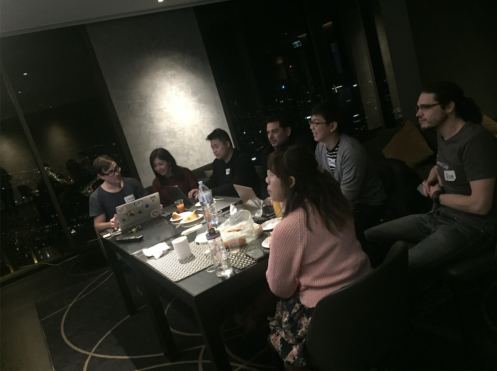
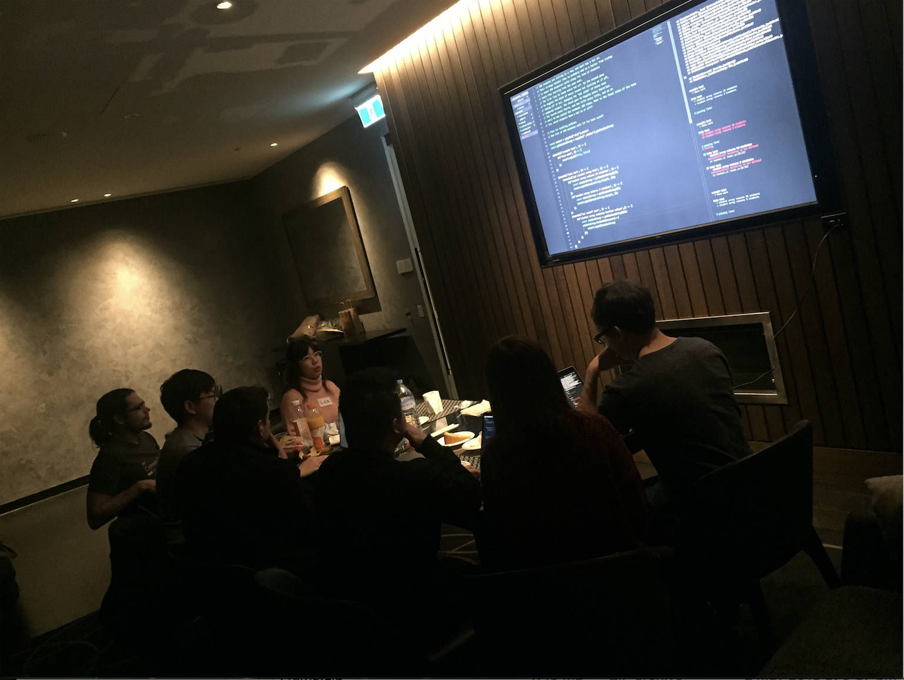
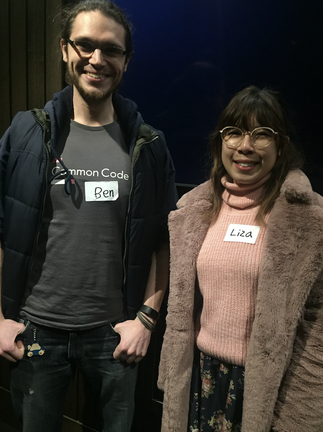

# Summary of TDD Workshop

I have invited two mentors and four classmates to my home lounge to run a mentoring session. It is for the practice of Test-Driven Development in JavaScript. We have worked on the hat kata and understood how testing works and what needs to be more improved in our code. Each person took their turn every 10 minutes for 1.5 hours. Mob programming has allowed us to expand our ideas by sharing different thoughts and knowledge and also going through refactoring together. 

## Attendee 
* Mentor: Ben Lomax, Liza Noogn
* Mentee: Serina Ko, Steven Christenson, Meng Lim, Peter, Maurice 

#### Two Mentors (Thank you so much! :))

## Retrospective

### 1) Good Stuff
* Friendly and accessible info on testing!
* Awesome snacks
* Effort by Ben & Liza to teach us
* Serina for organising and the awesome lounge
* Mob programming
* Hearing different ideas
* Refactoring practice

### 2) Needs Improvement
* Set up time
* Time-keeping

### 3) Bad Stuff :(